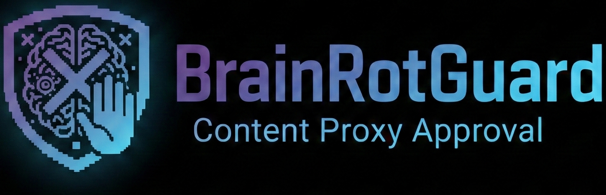
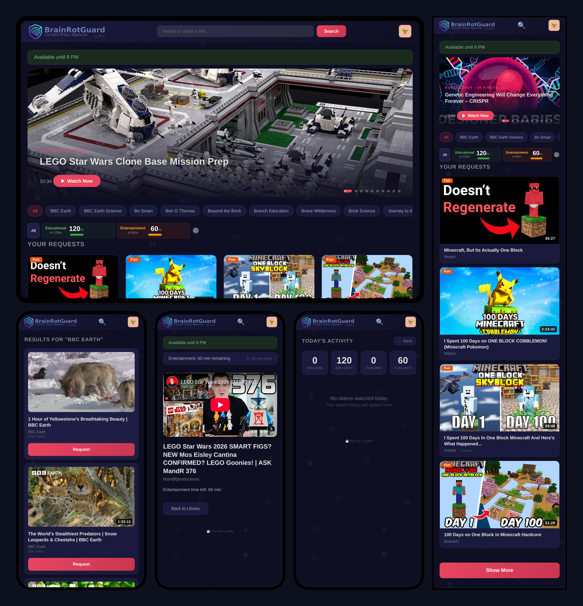

<p align="center">
  
</p>

<p align="center">
  <strong>YouTube approval system for kids.</strong><br>
  Your child searches for videos on a tablet. You approve or deny from your phone via Telegram.
</p>

---

## Contents
- [What Is This?](#what-is-this)
- [Features](#features)
- [What You'll Need](#what-youll-need)
- [Setup Guide](#setup-guide)
- [Running Without Docker](#running-without-docker)
- [Documentation](#documentation)
- [Project Structure](#project-structure)
- [License](#license)

## What Is This?

BrainRotGuard puts you in control of what your kids watch on YouTube — without standing over their shoulder.

Your child gets a simple web page on their tablet where they can search YouTube and request videos. Every request sends you a Telegram message with the video thumbnail, title, channel, and duration. You tap **Approve** or **Deny** right in the chat. If approved, the video starts playing on their tablet automatically.

No YouTube account needed. No ads. No algorithmic rabbit holes. No "up next" autoplay.

**Important:** For this to actually work, you need to [block YouTube at the DNS level](#step-5-block-youtube-on-the-kids-devices) on your kid's devices. Without that, there's nothing stopping them from just opening youtube.com or the YouTube app directly. The DNS block takes 5 minutes to set up and closes that gap completely — even the "suggested videos" that appear at the end of an embedded video won't load, because those links point to youtube.com which is blocked.

**Network requirement:** BrainRotGuard only works when your child's device is connected to your home network — that's where the DNS blocking and the web UI live. If you want this to work outside your home, you'd need to set up a VPN (e.g., [Tailscale](https://tailscale.com/), WireGuard) so the device tunnels back through your home network. If your child's device has mobile data, they can bypass your home DNS entirely — solving that is outside the scope of this project. **The good news:** you can approve or deny videos and manage channels from anywhere using the Telegram app on your phone. You don't need to be home for that part.

### How It Works

```
Kid's Tablet ----> BrainRotGuard Server ----> Router ----> Telegram Cloud ----> Parent's Phone
                                                |
                                          DNS (AdGuard/Pi-hole)
                                          X  youtube.com (blocked)
                                          OK youtube-nocookie.com (allowed)
```

1. Kid opens BrainRotGuard on their tablet and searches for a video
2. They tap **Request** on the one they want to watch
3. You get a Telegram notification with all the details
4. You tap **Approve** or **Deny**
5. Their screen updates automatically — approved videos play right away

### Screenshots

Works on any screen size — desktop, tablet, and phone:



### Demo

Kid searches, requests a video, parent approves via Telegram, video plays:

https://github.com/user-attachments/assets/53180ee4-1390-472e-bb5b-26f7f61c7407

### Why I Built This

I'm a father of a preteen son. I didn't want to block YouTube completely — YouTube is genuinely how I learn things myself, and I wanted my son to have that same ability to research topics, explore educational content, and develop the problem-solving habit of "let me figure this out." That's a skill I want him to have.

The problem was his feed. It was overrun with gamers screaming into microphones and brainrot content. I'd tell him to change the channel every time I walked by and heard one of those obnoxious gaming videos. He'd switch, but YouTube's algorithm would pull him right back within minutes. The algorithm is designed to keep kids glued — and it's very good at its job.

Every parental control I tried was either too restrictive (block YouTube entirely) or too permissive (YouTube Kids still recommends garbage). I needed the middle ground: let him explore and search freely, but give me the final say on what actually plays. So I vibe-engineered a solution.

BrainRotGuard removes the algorithm entirely. There's no autoplay, no "up next" sidebar, no recommendation engine pulling him deeper. He searches for what he wants, I approve or deny, and the video plays and stops. Done. No rabbit holes.

Don't want them watching gaming content? Block those channels. Tired of a specific creator? One tap. You can allow the channels you trust (educational, science, building, nature) and block the ones you don't — and it sticks. He picks what to ask for, I have the final say.

Now I curate his content and I can see the difference. He's not parroting gamer lingo back at me anymore. The stuff he watches is actually interesting — things he's curious about, things he's learning from. I pair this with Google Family Link on his device for general screen time, but BrainRotGuard is what controls YouTube specifically: daily time limits, scheduled access windows, and per-channel approval. Family Link says "the tablet turns off at 8pm." BrainRotGuard says "you can watch 2 hours of entertainment YouTube today, but educational content is unlimited — and only from channels I've approved."

## Features

### For Kids
- **Works on any device** — it's just a web page. Android tablet, iPad, laptop, phone, Kindle Fire — if it has a browser, it works
- **Simple search** — type what you want, see results, tap Request
- **Instant playback** — approved videos play immediately, no waiting
- **Video library** — browse everything that's been approved before
- **Category browsing** — filter by educational or entertainment content with one tap
- **Channel browsing** — see latest videos from pre-approved channels without needing to request each one
- **Dark theme** — easy on the eyes, designed for tablets

### For Parents
- **Telegram approval** — approve/deny from anywhere with one tap
- **Channel allow/block lists** — trust a channel once, and new videos from it are auto-approved
- **Edu/Fun categories** — label channels and videos as educational or entertainment, each with its own daily time limit
- **Daily screen time limits** — set separate limits for educational and entertainment content, or a single global limit
- **Scheduled hours** — define when watching is allowed (e.g., 8am–7pm, not during school)
- **Bonus time** — grant extra minutes for today only (`/time add 30`)
- **Watch activity log** — see what was watched, for how long, grouped by category
- **Word filters** — block videos whose titles contain specific words
- **Search history** — see everything your child has searched for
- **PIN lock** — optional PIN gate so only your kid can access the web UI on the right device

### Privacy & Security
- **100% self-hosted** — runs entirely on your own hardware inside your home network. No cloud service, no third-party accounts, no subscriptions. Your data stays yours.
- **No YouTube account required** — no sign-in, no tracking, no personalized ads
- **No API key needed** — uses [yt-dlp](https://github.com/yt-dlp/yt-dlp) for search and metadata
- **Privacy-respecting embeds** — videos play via `youtube-nocookie.com` (Google's reduced-tracking embed domain)
- **Single-file database** — all data is one SQLite file on your machine. Nothing phones home, nothing syncs to a server you don't control.
- **Container runs as non-root** — Docker security best practice

## What You'll Need

**Minimum skill level:** You should be comfortable copy-pasting commands into a terminal. If you've never opened a terminal before, an AI assistant (like ChatGPT, Claude, or Gemini) can walk you through each step — just share this README with it.

### Required

| Requirement | What It Is | How to Get It |
|-------------|-----------|---------------|
| **A computer that stays on** | Runs the app 24/7 so it's always available. A Raspberry Pi, old laptop, or home server all work. | Anything running Linux, macOS, or Windows with Docker |
| **Docker** | Packages the app so it runs the same everywhere. You install it once. | [Install Docker](https://docs.docker.com/get-docker/) |
| **Telegram account** | The messaging app where you'll receive approval requests | [Android (Google Play)](https://play.google.com/store/apps/details?id=org.telegram.messenger) · [iPhone (App Store)](https://apps.apple.com/app/telegram-messenger/id686449807) · or search "Telegram" in your app store |
| **Telegram bot token** | A key that lets BrainRotGuard send you messages | Created in 5 minutes via [@BotFather](https://core.telegram.org/bots#how-do-i-create-a-bot) (see setup guide below) |

> **Why Telegram?** It was the easiest way to build instant notifications with approve/deny buttons that work from your phone. No custom app to develop, no push notification infrastructure to maintain — Telegram handles all of that.
>
> **A note on Telegram safety:** Telegram is a public messaging platform with millions of users, and like any open platform, it has scammers and spam. Protect yourself: **don't use your real name** as your Telegram display name, **don't respond to unsolicited messages** from strangers, and **never share personal or financial information** in Telegram chats you didn't initiate. BrainRotGuard only needs Telegram for the parent-to-bot communication — your child never needs a Telegram account. By using Telegram with this project, you acknowledge that you understand the risks of the platform and that the author of BrainRotGuard is not responsible for any interactions or incidents that occur on Telegram outside of this application.

### Effectively Required

| Requirement | What It Is | Why |
|-------------|-----------|-----|
| **DNS-level blocking** | Blocks YouTube on the kid's device at the network level so they *can't* bypass BrainRotGuard by opening youtube.com or the YouTube app | [AdGuard Home](https://adguard.com/en/adguard-home/overview.html), [Pi-hole](https://pi-hole.net/), or router-level blocking |

## Setup Guide

### Step 1: Create a Telegram Bot

1. Open Telegram and search for **@BotFather**
2. Send `/newbot`
3. Choose a name (e.g., "BrainRotGuard") and a username (e.g., "mybrainrotguard_bot")
4. BotFather gives you a **token** — it looks like `123456789:ABCdefGhIjKlMnOpQrStUvWxYz`. Copy it, you'll need it in Step 3.

### Step 2: Get Your Chat ID

1. Open a chat with the bot you just created and send it any message (e.g., "hello")
2. Open this URL in your browser (replace `YOUR_TOKEN` with the token from Step 1):
   ```
   https://api.telegram.org/botYOUR_TOKEN/getUpdates
   ```
3. Look for `"chat":{"id":123456789}` in the response — that number is your **chat ID**

### Step 3: Install BrainRotGuard

```bash
# Download the project
git clone https://github.com/GHJJ123/brainrotguard.git
cd brainrotguard

# Create your secrets file
cp .env.example .env
```

Edit the `.env` file and fill in your values:
```
BRG_BOT_TOKEN=123456789:ABCdefGhIjKlMnOpQrStUvWxYz
BRG_ADMIN_CHAT_ID=987654321
BRG_PIN=1234
```

| Setting | What to put | Required? |
|---------|------------|-----------|
| `BRG_BOT_TOKEN` | The token from Step 1 | Yes |
| `BRG_ADMIN_CHAT_ID` | The chat ID from Step 2 | Yes |
| `BRG_PIN` | A PIN code kids enter to use the web UI. Leave empty to skip. | No |

### Step 4: Start It Up

```bash
docker compose up -d
```

That's it. Open `http://<your-server-ip>:8080` on the kid's tablet.

To check that it's running:
```bash
docker compose logs -f
```

To stop it:
```bash
docker compose down
```

To update to a new version:
```bash
git pull
docker compose up -d --build
```

### Step 5: Block YouTube on the Kid's Devices

Without this step, your kid can just open youtube.com in a browser or use the YouTube app and bypass BrainRotGuard entirely. DNS-level blocking prevents that — it makes YouTube unreachable on their devices while keeping BrainRotGuard's embedded playback working.

**Block these domains** (prevents direct YouTube access):
- `youtube.com`
- `www.youtube.com`
- `m.youtube.com`
- `youtubei.googleapis.com`

**Allow these domains** (required for embedded playback through BrainRotGuard):
- `www.youtube-nocookie.com`
- `*.googlevideo.com`

#### AdGuard Home

1. Go to **Filters** > **Custom filtering rules**
2. Add blocking rules:
   ```
   ||youtube.com^
   ||m.youtube.com^
   ||youtubei.googleapis.com^
   ```
3. Add allowlist rules (under **DNS allowlists** or prefix with `@@`):
   ```
   @@||www.youtube-nocookie.com^
   @@||googlevideo.com^
   ```
4. Under **Client settings**, apply these rules only to the kid's device if you don't want to block YouTube for everyone on your network

#### Pi-hole

Add the block domains to your blocklist and the allow domains to your allowlist. Same domains, just entered through the Pi-hole admin UI.

#### Other Options

Any DNS filtering tool that lets you block/allow specific domains will work — pfBlockerNG, NextDNS, router-level parental controls, etc.

## Running Without Docker

If you'd rather run it directly with Python (e.g., on a Raspberry Pi without Docker):

**Requires:** Python 3.11 or newer

```bash
git clone https://github.com/GHJJ123/brainrotguard.git
cd brainrotguard

# Install dependencies
pip install -r requirements.txt

# Set up secrets and config
cp .env.example .env
# Edit .env with your bot token and chat ID

cp config.example.yaml config.yaml
# Edit config.yaml if you want to change defaults

# Run
export $(cat .env | xargs) && python main.py -c config.yaml -v
```

To keep it running in the background, use `screen`, `tmux`, or set up a systemd service.

## Documentation

- [Configuration Reference](docs/configuration.md) — config.yaml options, environment variables, defaults
- [Telegram Commands](docs/telegram-commands.md) — full command list for the parent bot
- [Troubleshooting](docs/troubleshooting.md) — common issues and fixes
- [Architecture](docs/architecture.md) — system diagrams and request flow
- [Design Decisions](docs/design-decisions.md) — why yt-dlp, Telegram, SQLite, etc.

## Project Structure

```
main.py                # Orchestrator: runs FastAPI + Telegram bot together
config.py              # Loads config from YAML with ${ENV_VAR} expansion
version.py             # Version string
web/app.py             # FastAPI web routes and API endpoints
web/templates/         # HTML templates (Jinja2)
web/static/            # CSS, logos, favicon
bot/telegram_bot.py    # Telegram bot: notifications, commands, inline callbacks
data/video_store.py    # SQLite database operations
youtube/extractor.py   # yt-dlp wrapper: search + metadata extraction
deploy.sh              # Deployment script for remote servers
```

## License

[MIT](LICENSE) — use it however you want.
